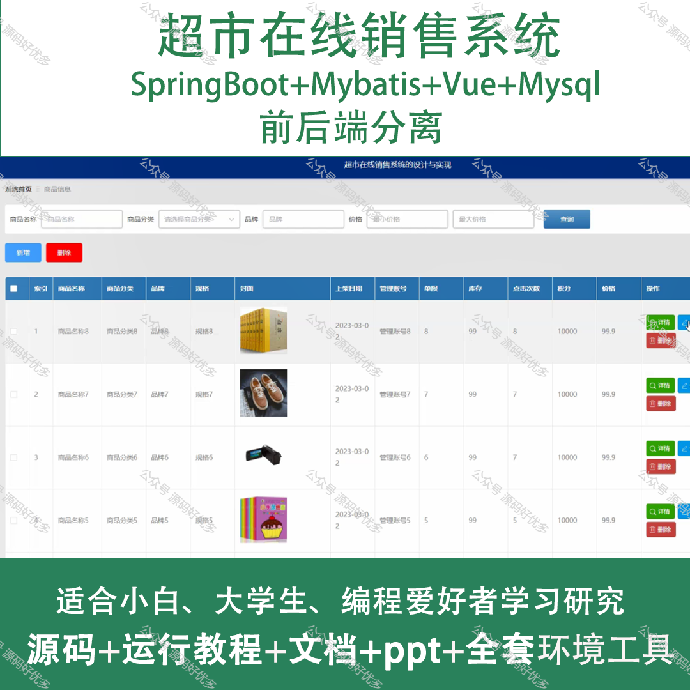
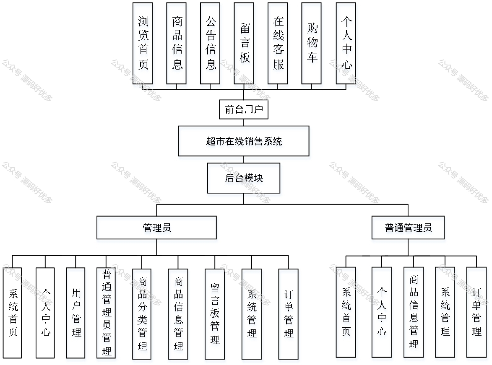
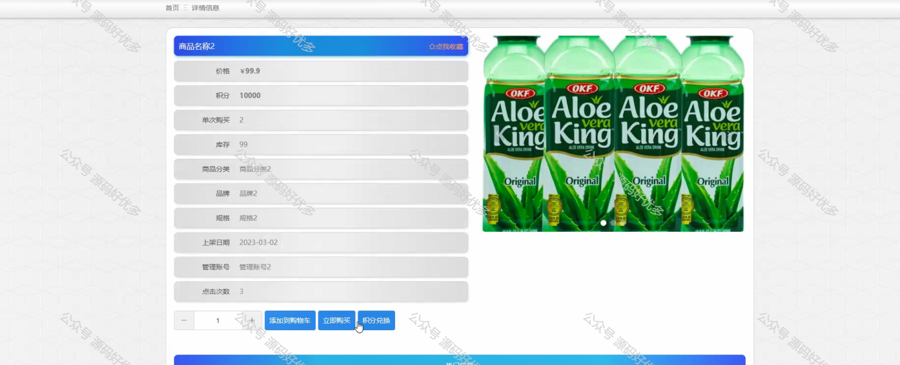
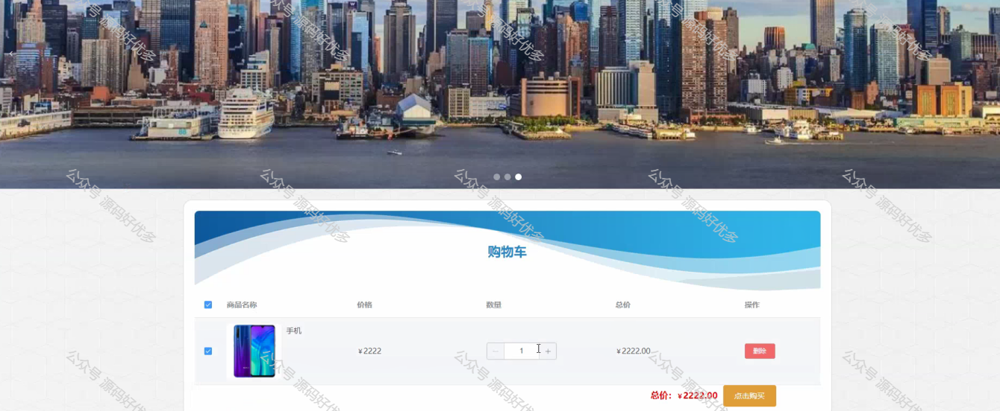
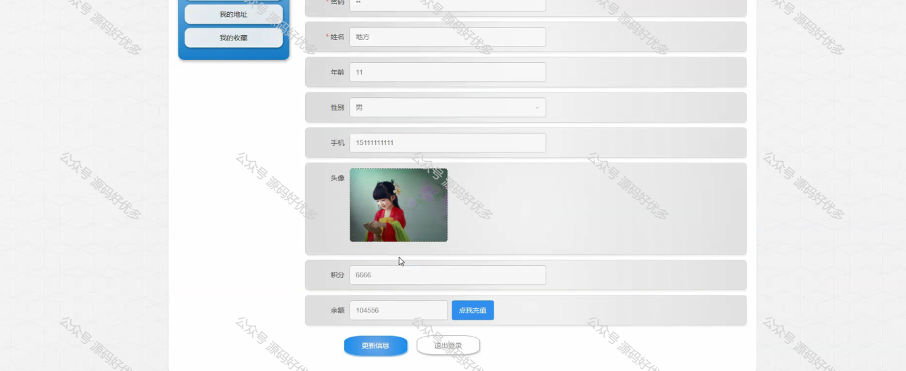
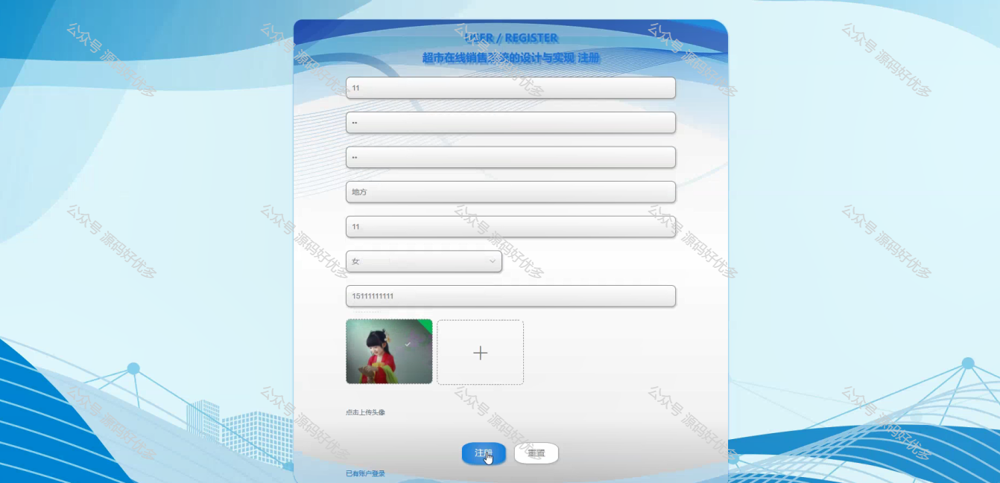
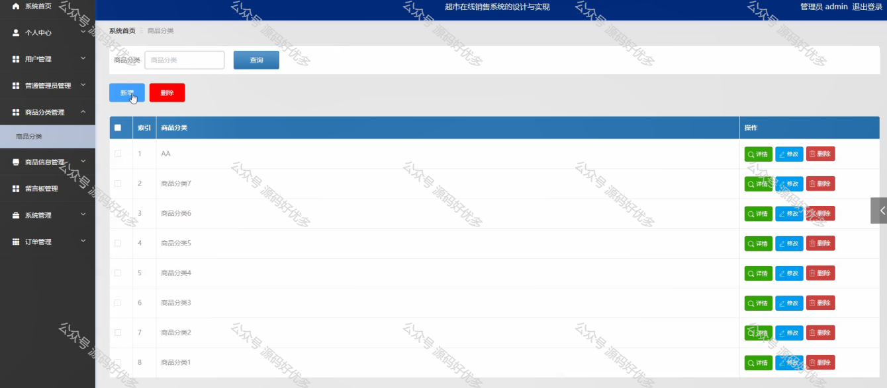
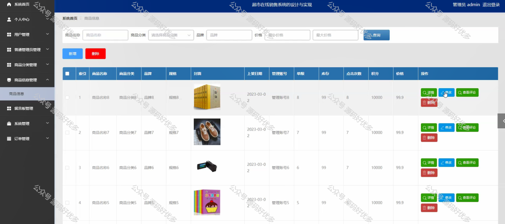
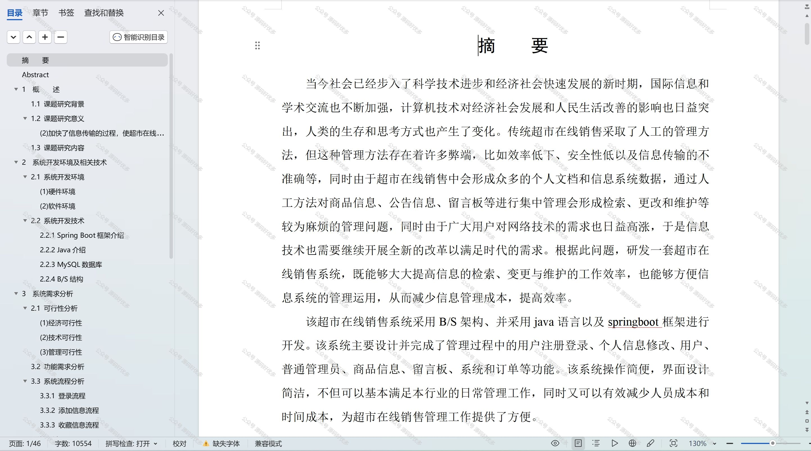

 
## 查看主页获取源码

> **作者介绍**： **✌**全网粉丝10W+本平台特邀作者、博客专家、CSDN新星计划导师、java领域优质创作者,博客之星、掘金/华为云/阿里云/InfoQ等平台优质作者、专注于项目实战 **✌**

  

### 一、作品包含

源码+数据库+设计文档万字+PPT+全套环境和工具资源+部署教程

### 二、项目技术

前端技术：Html、Css、Js、Vue、Element-ui

数据库：MySQL

后端技术：Java、Spring Boot、MyBatis

  

### 三、运行环境

开发工具：IDEA/eclipse

数据库：MySQL5.7

数据库管理工具：Navicat10以上版本

环境配置软件： JDK1.8+Maven3.6.3

前端Nodejs：14

### 四、项目介绍
项目编号：springbootA135

随着互联网技术的不断发展和消费者购物习惯的转变，超市在线销售系统应运而生。该系统通过搭建一个集商品展示、在线下单、支付结算，旨在打破传统超市的时空限制，满足消费者便捷、快速、多样化的购物需求，同时为超市开辟新的销售渠道，提升市场竞争力，实现线上线下的融合发展。

前台用户功能：浏览首页、商品信息、公告信息、留言板、在线客服、购物车和个人中心。

后台分为管理员和普通管理员
管理员的功能：系统首页、个人中心、用户管理、普通管理员管理、商品分类管理、商品信息管理、留言板管理、系统管理、订单管理。
普通管理员的功能：系统首页、个人中心、商品信息管理、系统管理、订单管理。

### 五、运行截图

  
